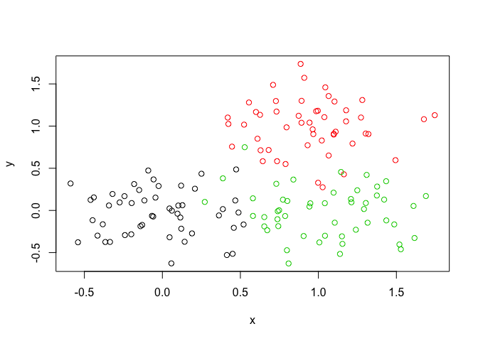
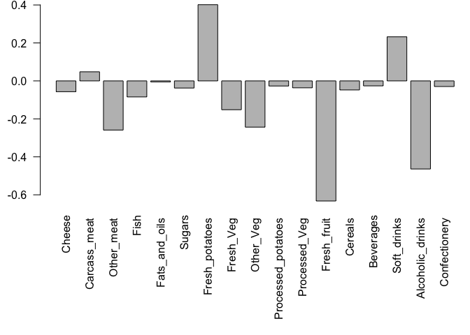

Class 8: clustering and PCA
================
Madison Hale
2/5/2019

K-means clustering
------------------

``` r
# Generate some example data for clustering
tmp <- c(rnorm(30,-3), rnorm(30,3))
x <- cbind(x = tmp, y = rev(tmp))

plot(x)
```


Use the kmeans() function setting k to 2 and nstart=20 Inspect/print the results Q. How many points are in each cluster? Q. What ‘component’ of your result object details - cluster size? - cluster assignment/membership? - cluster center? Plot x colored by the kmeans cluster assignment and add cluster centers as blue points

``` r
km <- kmeans(x, centers = 2, nstart = 20)
#View(km)

#used ?kmeans in console 
```

``` r
#prints km
km
```

    ## K-means clustering with 2 clusters of sizes 30, 30
    ## 
    ## Cluster means:
    ##           x         y
    ## 1  2.820805 -2.855138
    ## 2 -2.855138  2.820805
    ## 
    ## Clustering vector:
    ##  [1] 2 2 2 2 2 2 2 2 2 2 2 2 2 2 2 2 2 2 2 2 2 2 2 2 2 2 2 2 2 2 1 1 1 1 1
    ## [36] 1 1 1 1 1 1 1 1 1 1 1 1 1 1 1 1 1 1 1 1 1 1 1 1 1
    ## 
    ## Within cluster sum of squares by cluster:
    ## [1] 62.62967 62.62967
    ##  (between_SS / total_SS =  88.5 %)
    ## 
    ## Available components:
    ## 
    ## [1] "cluster"      "centers"      "totss"        "withinss"    
    ## [5] "tot.withinss" "betweenss"    "size"         "iter"        
    ## [9] "ifault"

``` r
km$size 
```

    ## [1] 30 30

``` r
#tells us there are 30 points in each cluster
```

Cluster membership assignment vector (which group data points lie in)

``` r
km$cluster
```

    ##  [1] 2 2 2 2 2 2 2 2 2 2 2 2 2 2 2 2 2 2 2 2 2 2 2 2 2 2 2 2 2 2 1 1 1 1 1
    ## [36] 1 1 1 1 1 1 1 1 1 1 1 1 1 1 1 1 1 1 1 1 1 1 1 1 1

Plots points, colors differ based on cluster

``` r
plot(x, col = km$cluster)
points(km$centers, col = "green", pch = 15, cex = 2)
```


``` r
km$totss
```

    ## [1] 1091.749

Hierarchical clustering in R
----------------------------

``` r
# First we need to calculate point (dis)similarity
# as the Euclidean distance between observations
dist_matrix <- dist(x)


# The hclust() function returns a hierarchical
# clustering model
hc <- hclust(d = dist_matrix)


# the print method is not so useful here
hc 
```

    ## 
    ## Call:
    ## hclust(d = dist_matrix)
    ## 
    ## Cluster method   : complete 
    ## Distance         : euclidean 
    ## Number of objects: 60

``` r
#viewing the data
#View(hc)
#View(x)
#View(as.matrix(dist_matrix))
dim(as.matrix(dist_matrix))
```

    ## [1] 60 60

``` r
#draws a dendrogram...tall "goal post means points are far apart"
plot(hc)
abline(h = 6, col = "red")
```


``` r
#two ways to use cutree()
cutree(hc, h = 6) # Cut by height h
```

    ##  [1] 1 1 1 1 1 1 1 1 1 1 1 1 1 1 1 1 1 1 1 1 1 1 1 1 1 1 1 1 1 1 2 2 2 2 2
    ## [36] 2 2 2 2 2 2 2 2 2 2 2 2 2 2 2 2 2 2 2 2 2 2 2 2 2

``` r
#or...
cutree(hc, k = 2) # Cut into k grps
```

    ##  [1] 1 1 1 1 1 1 1 1 1 1 1 1 1 1 1 1 1 1 1 1 1 1 1 1 1 1 1 1 1 1 2 2 2 2 2
    ## [36] 2 2 2 2 2 2 2 2 2 2 2 2 2 2 2 2 2 2 2 2 2 2 2 2 2

Linkage (linking clusters) in R
-------------------------------

``` r
# Using different hierarchical clustering methods
d <- dist_matrix
hc.complete <- hclust(d, method = "complete")
plot(hc.complete)
```


``` r
hc.average <- hclust(d, method = "average")
plot(hc.average)
```


``` r
hc.single <- hclust(d, method = "single")
plot(hc.single)
```


``` r
#want results to be independent of which linkage method is used
```

Trying this out!
----------------

``` r
# Step 1. Generate some example data for clustering
x <- rbind(
 matrix(rnorm(100, mean = 0, sd = 0.3), ncol = 2), # c1
 matrix(rnorm(100, mean = 1, sd = 0.3), ncol = 2), # c2
 matrix(c(rnorm(50, mean = 1, sd = 0.3), # c3
 rnorm(50, mean = 0, sd = 0.3)), ncol = 2))

colnames(x) <- c("x", "y")
```

``` r
# Step 2. Plot the data without clustering
plot(x)
```


``` r
# Step 3. Generate colors for known clusters
# (just so we can compare to hclust results)
col <- as.factor( rep(c("c1","c2","c3"), each = 50) )
plot(x, col = col)
```



Use the dist(), hclust(), plot() and cutree() functions to return 2 and 3 clusters

``` r
d <- dist(x)
hc <- hclust(d)
#dim(as.matrix(hc))
plot(hc)
```


``` r
plot(hc)
abline( h = 2.5, col = "red")
abline( h = 2, col = "blue")
```


``` r
gp2 <- cutree(hc, k = 2)
gp3 <- cutree(hc, k = 3)
plot(x, col = gp3)
```


The two functions we are learning: kmeans( x, centers = \#, nstart = \#) hclust( dist(x))

PCA = Principal Component Analysis...helps to analyze spread of data -&gt; PCA converts the correlations (or lack there of) among all cells into a representation we can more readily interpret (e.g. a 2D graph!)

NOTE: The PCs (i.e. new plot axis) are ranked by their importance...PC1 is more important than PC2 which in turn is more important than PC3 etc. The PCs (i.e. new plot axis) are ranked by the amount of variance in the original data that they “capture”. ...in R, PCA is used with prcomp()

Using PCA
---------

``` r
## downloaded file from class website
mydata <- read.csv("https://tinyurl.com/expression-CSV", row.names = 1)

head(mydata)
```

    ##        wt1 wt2  wt3  wt4 wt5 ko1 ko2 ko3 ko4 ko5
    ## gene1  439 458  408  429 420  90  88  86  90  93
    ## gene2  219 200  204  210 187 427 423 434 433 426
    ## gene3 1006 989 1030 1017 973 252 237 238 226 210
    ## gene4  783 792  829  856 760 849 856 835 885 894
    ## gene5  181 249  204  244 225 277 305 272 270 279
    ## gene6  460 502  491  491 493 612 594 577 618 638

``` r
#head(t(mydata))
pca <-  prcomp(t(mydata), scale = TRUE)
attributes(pca) 
```

    ## $names
    ## [1] "sdev"     "rotation" "center"   "scale"    "x"       
    ## 
    ## $class
    ## [1] "prcomp"

``` r
## A basic PC1 vs PC2 2-D plot 
plot(pca$x[,1], pca$x[,2])
```


``` r
## Variance captured per PC
pca.var <- pca$sdev^2 

## Precent variance is often more informative to look at
pca.var <- pca$sdev^2
pca.var.per <- round(pca.var/sum(pca.var)*100, 1) 

pca.var.per
```

    ##  [1] 92.6  2.3  1.1  1.1  0.8  0.7  0.6  0.4  0.4  0.0

``` r
barplot(pca.var.per, main = "Scree Plot", xlab = "Principal Component", ylab = "Percent Variation")
```


``` r
#improving the plot
## A vector of colors for wt and ko samples
colvec <- colnames(mydata)
colvec[grep("wt", colvec)] <- "red"
colvec[grep("ko", colvec)] <- "blue"
plot(pca$x[,1], pca$x[,2], col = colvec, pch = 16,
 xlab = paste0("PC1 (", pca.var.per[1], "%)"),
 ylab = paste0("PC2 (", pca.var.per[2], "%)")) 
```


``` r
#and even better

plot(pca$x[,1], pca$x[,2], col = colvec, pch = 16, xlab = paste0("PC1 (", pca.var.per[1], "%)"), ylab = paste0("PC2 (", pca.var.per[2], "%)"))
## Click to identify which sample is which
identify(pca$x[,1], pca$x[,2], labels = colnames(mydata))
```


    ## integer(0)

``` r
## Press ESC to exit… 
```

Perform a PCA on the UK foods dataset
-------------------------------------

Input: read, View/head PCA: prcomp Plots: PCA plot, scree plot, loadings plot.

``` r
x <- read.csv("UK_foods.csv")
dim(x)
```

    ## [1] 17  5

Side-Note: Never leave a View() function call uncommented in your Rmarkdown document...this is intended for interactive use and will stop the Knit rendering process when you go to generate HTML, PDF, MD etc. reports.
========================================================================================================================================================================================================================

``` r
#View(x[6,])

#fixing: set rownames() to the first column and then remove troublesome first column (with the -1 column index)

rownames(x) <- x[,1]
x <- x[,-1]
head(x)
```

    ##                England Wales Scotland N.Ireland
    ## Cheese             105   103      103        66
    ## Carcass_meat       245   227      242       267
    ## Other_meat         685   803      750       586
    ## Fish               147   160      122        93
    ## Fats_and_oils      193   235      184       209
    ## Sugars             156   175      147       139

``` r
#better way to set proper row_names (reading data properly in the first place):

x <- read.csv("UK_foods.csv", row.names = 1)
head(x)
```

    ##                England Wales Scotland N.Ireland
    ## Cheese             105   103      103        66
    ## Carcass_meat       245   227      242       267
    ## Other_meat         685   803      750       586
    ## Fish               147   160      122        93
    ## Fats_and_oils      193   235      184       209
    ## Sugars             156   175      147       139

Trying to spot differences in data with some plots

``` r
barplot(as.matrix(x), beside = T, col = rainbow(nrow(x)))
```


``` r
barplot(as.matrix(x), beside = F, col = rainbow(nrow(x)))
```


``` r
pairs(x, col = rainbow(10), pch = 16)
```


``` r
#these plots are all challenging to interpret
```

PCA to the rescue!

``` r
# prcomp() expects the observations to be rows and the variables to be columns therefore we need to first transpose our data.frame matrix with the t() transpose function

# Use the prcomp() PCA function 
pca <- prcomp( t(x) )
summary(pca)
```

    ## Importance of components:
    ##                             PC1      PC2      PC3       PC4
    ## Standard deviation     324.1502 212.7478 73.87622 4.189e-14
    ## Proportion of Variance   0.6744   0.2905  0.03503 0.000e+00
    ## Cumulative Proportion    0.6744   0.9650  1.00000 1.000e+00

``` r
# Plot PC1 vs PC2
plot(pca$x[,1], pca$x[,2], xlab = "PC1", ylab = "PC2", xlim = c(-270,500))
text(pca$x[,1], pca$x[,2], colnames(x), col = c("red", "yellow", "orange", "green"))
```


### Examining the "loadings"

This will help us determine how the origional variables (dimensions) contribute to our new PCs

``` r
## Lets focus on PC1 as it accounts for > 90% of variance 
par(mar = c(10, 3, 0.35, 0))
barplot( pca$rotation[,1], las = 2 )
```

 PCAs reduce dimensionality so we can better visualize/interpret data and observe outliers.
