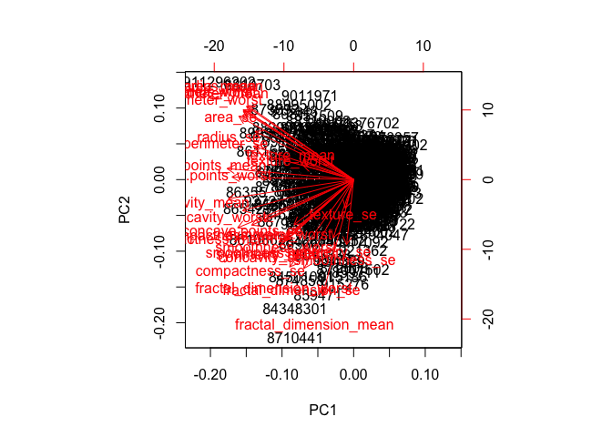
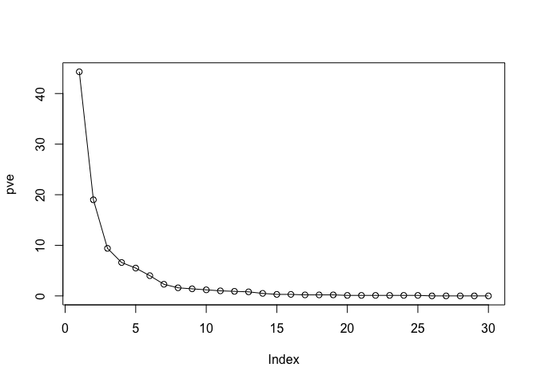
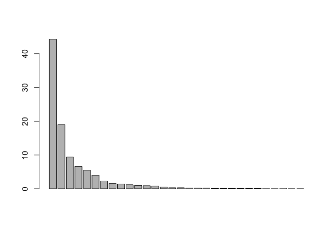
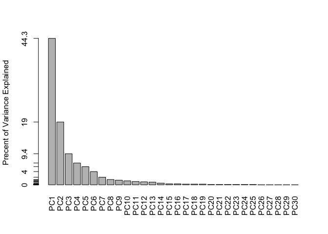
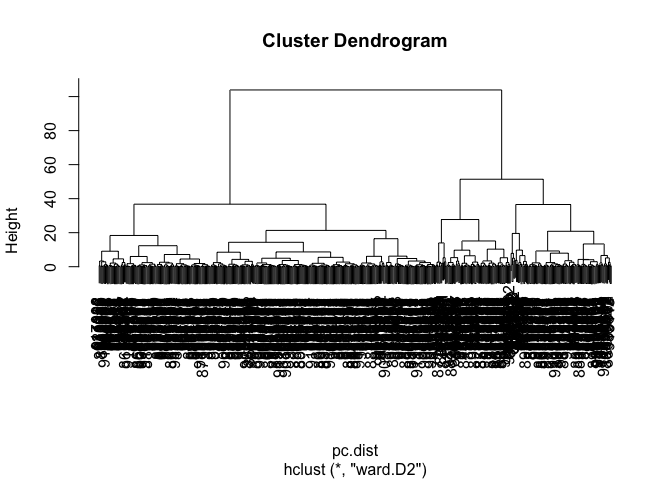
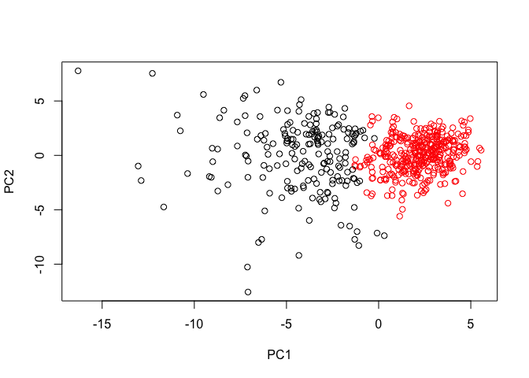
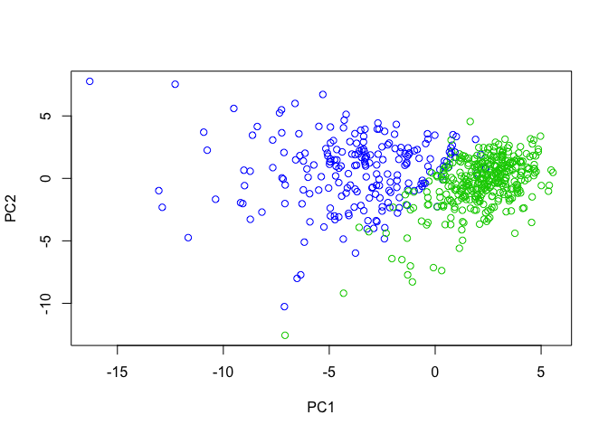
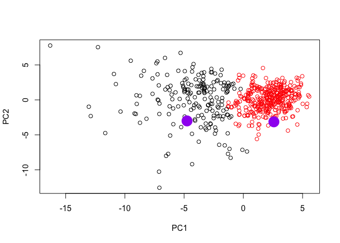

Class 9: Unsupervised Learning Mini-Project
================
Madison Hale
2/7/2019

Human Breast Cancer Cells
-------------------------

``` r
fna.data <- "WisconsinCancer.csv"
wisc.df <- read.csv(fna.data)
head(wisc.df)
```

    ##         id diagnosis radius_mean texture_mean perimeter_mean area_mean
    ## 1   842302         M       17.99        10.38         122.80    1001.0
    ## 2   842517         M       20.57        17.77         132.90    1326.0
    ## 3 84300903         M       19.69        21.25         130.00    1203.0
    ## 4 84348301         M       11.42        20.38          77.58     386.1
    ## 5 84358402         M       20.29        14.34         135.10    1297.0
    ## 6   843786         M       12.45        15.70          82.57     477.1
    ##   smoothness_mean compactness_mean concavity_mean concave.points_mean
    ## 1         0.11840          0.27760         0.3001             0.14710
    ## 2         0.08474          0.07864         0.0869             0.07017
    ## 3         0.10960          0.15990         0.1974             0.12790
    ## 4         0.14250          0.28390         0.2414             0.10520
    ## 5         0.10030          0.13280         0.1980             0.10430
    ## 6         0.12780          0.17000         0.1578             0.08089
    ##   symmetry_mean fractal_dimension_mean radius_se texture_se perimeter_se
    ## 1        0.2419                0.07871    1.0950     0.9053        8.589
    ## 2        0.1812                0.05667    0.5435     0.7339        3.398
    ## 3        0.2069                0.05999    0.7456     0.7869        4.585
    ## 4        0.2597                0.09744    0.4956     1.1560        3.445
    ## 5        0.1809                0.05883    0.7572     0.7813        5.438
    ## 6        0.2087                0.07613    0.3345     0.8902        2.217
    ##   area_se smoothness_se compactness_se concavity_se concave.points_se
    ## 1  153.40      0.006399        0.04904      0.05373           0.01587
    ## 2   74.08      0.005225        0.01308      0.01860           0.01340
    ## 3   94.03      0.006150        0.04006      0.03832           0.02058
    ## 4   27.23      0.009110        0.07458      0.05661           0.01867
    ## 5   94.44      0.011490        0.02461      0.05688           0.01885
    ## 6   27.19      0.007510        0.03345      0.03672           0.01137
    ##   symmetry_se fractal_dimension_se radius_worst texture_worst
    ## 1     0.03003             0.006193        25.38         17.33
    ## 2     0.01389             0.003532        24.99         23.41
    ## 3     0.02250             0.004571        23.57         25.53
    ## 4     0.05963             0.009208        14.91         26.50
    ## 5     0.01756             0.005115        22.54         16.67
    ## 6     0.02165             0.005082        15.47         23.75
    ##   perimeter_worst area_worst smoothness_worst compactness_worst
    ## 1          184.60     2019.0           0.1622            0.6656
    ## 2          158.80     1956.0           0.1238            0.1866
    ## 3          152.50     1709.0           0.1444            0.4245
    ## 4           98.87      567.7           0.2098            0.8663
    ## 5          152.20     1575.0           0.1374            0.2050
    ## 6          103.40      741.6           0.1791            0.5249
    ##   concavity_worst concave.points_worst symmetry_worst
    ## 1          0.7119               0.2654         0.4601
    ## 2          0.2416               0.1860         0.2750
    ## 3          0.4504               0.2430         0.3613
    ## 4          0.6869               0.2575         0.6638
    ## 5          0.4000               0.1625         0.2364
    ## 6          0.5355               0.1741         0.3985
    ##   fractal_dimension_worst  X
    ## 1                 0.11890 NA
    ## 2                 0.08902 NA
    ## 3                 0.08758 NA
    ## 4                 0.17300 NA
    ## 5                 0.07678 NA
    ## 6                 0.12440 NA

``` r
#View(wisc.df)
```

How many samples (patients) are in this data set?

``` r
nrow(wisc.df)
```

    ## [1] 569

``` r
colnames(wisc.df)
```

    ##  [1] "id"                      "diagnosis"              
    ##  [3] "radius_mean"             "texture_mean"           
    ##  [5] "perimeter_mean"          "area_mean"              
    ##  [7] "smoothness_mean"         "compactness_mean"       
    ##  [9] "concavity_mean"          "concave.points_mean"    
    ## [11] "symmetry_mean"           "fractal_dimension_mean" 
    ## [13] "radius_se"               "texture_se"             
    ## [15] "perimeter_se"            "area_se"                
    ## [17] "smoothness_se"           "compactness_se"         
    ## [19] "concavity_se"            "concave.points_se"      
    ## [21] "symmetry_se"             "fractal_dimension_se"   
    ## [23] "radius_worst"            "texture_worst"          
    ## [25] "perimeter_worst"         "area_worst"             
    ## [27] "smoothness_worst"        "compactness_worst"      
    ## [29] "concavity_worst"         "concave.points_worst"   
    ## [31] "symmetry_worst"          "fractal_dimension_worst"
    ## [33] "X"

use as.matrix() to convert the other features (i.e. columns) of the data (in columns 3 through 32) to a matrix. Store this in a variable called wisc.data.

``` r
wisc.data <- as.matrix(wisc.df[,3:32])

#adding rownames to our new matrix of data
row.names(wisc.data) <- wisc.df$id

head(wisc.data)
```

    ##          radius_mean texture_mean perimeter_mean area_mean smoothness_mean
    ## 842302         17.99        10.38         122.80    1001.0         0.11840
    ## 842517         20.57        17.77         132.90    1326.0         0.08474
    ## 84300903       19.69        21.25         130.00    1203.0         0.10960
    ## 84348301       11.42        20.38          77.58     386.1         0.14250
    ## 84358402       20.29        14.34         135.10    1297.0         0.10030
    ## 843786         12.45        15.70          82.57     477.1         0.12780
    ##          compactness_mean concavity_mean concave.points_mean symmetry_mean
    ## 842302            0.27760         0.3001             0.14710        0.2419
    ## 842517            0.07864         0.0869             0.07017        0.1812
    ## 84300903          0.15990         0.1974             0.12790        0.2069
    ## 84348301          0.28390         0.2414             0.10520        0.2597
    ## 84358402          0.13280         0.1980             0.10430        0.1809
    ## 843786            0.17000         0.1578             0.08089        0.2087
    ##          fractal_dimension_mean radius_se texture_se perimeter_se area_se
    ## 842302                  0.07871    1.0950     0.9053        8.589  153.40
    ## 842517                  0.05667    0.5435     0.7339        3.398   74.08
    ## 84300903                0.05999    0.7456     0.7869        4.585   94.03
    ## 84348301                0.09744    0.4956     1.1560        3.445   27.23
    ## 84358402                0.05883    0.7572     0.7813        5.438   94.44
    ## 843786                  0.07613    0.3345     0.8902        2.217   27.19
    ##          smoothness_se compactness_se concavity_se concave.points_se
    ## 842302        0.006399        0.04904      0.05373           0.01587
    ## 842517        0.005225        0.01308      0.01860           0.01340
    ## 84300903      0.006150        0.04006      0.03832           0.02058
    ## 84348301      0.009110        0.07458      0.05661           0.01867
    ## 84358402      0.011490        0.02461      0.05688           0.01885
    ## 843786        0.007510        0.03345      0.03672           0.01137
    ##          symmetry_se fractal_dimension_se radius_worst texture_worst
    ## 842302       0.03003             0.006193        25.38         17.33
    ## 842517       0.01389             0.003532        24.99         23.41
    ## 84300903     0.02250             0.004571        23.57         25.53
    ## 84348301     0.05963             0.009208        14.91         26.50
    ## 84358402     0.01756             0.005115        22.54         16.67
    ## 843786       0.02165             0.005082        15.47         23.75
    ##          perimeter_worst area_worst smoothness_worst compactness_worst
    ## 842302            184.60     2019.0           0.1622            0.6656
    ## 842517            158.80     1956.0           0.1238            0.1866
    ## 84300903          152.50     1709.0           0.1444            0.4245
    ## 84348301           98.87      567.7           0.2098            0.8663
    ## 84358402          152.20     1575.0           0.1374            0.2050
    ## 843786            103.40      741.6           0.1791            0.5249
    ##          concavity_worst concave.points_worst symmetry_worst
    ## 842302            0.7119               0.2654         0.4601
    ## 842517            0.2416               0.1860         0.2750
    ## 84300903          0.4504               0.2430         0.3613
    ## 84348301          0.6869               0.2575         0.6638
    ## 84358402          0.4000               0.1625         0.2364
    ## 843786            0.5355               0.1741         0.3985
    ##          fractal_dimension_worst
    ## 842302                   0.11890
    ## 842517                   0.08902
    ## 84300903                 0.08758
    ## 84348301                 0.17300
    ## 84358402                 0.07678
    ## 843786                   0.12440

``` r
#checking the dimensions
dim(wisc.data)
```

    ## [1] 569  30

Finally, setup a separate new vector called diagnosis to be 1 if a diagnosis is malignant ("M") and 0 otherwise. Note that R coerces TRUE to 1 and FALSE to 0.

How many cancer (M) and non cancer (B) samples do we have in our data-set?

``` r
# Create diagnosis vector by completing the missing code
table(wisc.df$diagnosis)
```

    ## 
    ##   B   M 
    ## 357 212

``` r
diagnosis <- as.numeric(wisc.df$diagnosis)
#tmp <- rep(0, nrow(wisc.df))
diagnosis <- as.numeric(wisc.df$diagnosis == "M")
```

Q1. How many observations are in this dataset?

``` r
nrow(wisc.data)
```

    ## [1] 569

Q2. How many variables/features in the data are suffixed with \_mean?

``` r
#?grep
inds <- grep("_mean", colnames(wisc.data))
length(inds)
```

    ## [1] 10

``` r
#checking with: colnames(wisc.data)
```

Q3. How many of the observations have a malignant diagnosis?

``` r
sum(diagnosis)
```

    ## [1] 212

set-up finished...now time for PCA!
-----------------------------------

Check the mean and standard deviation of the features (i.e. columns) of the wisc.data to determine if the data should be scaled. Use the colMeans() and apply() functions

``` r
# Check column means and standard deviations
colMeans(wisc.data)
```

    ##             radius_mean            texture_mean          perimeter_mean 
    ##            1.412729e+01            1.928965e+01            9.196903e+01 
    ##               area_mean         smoothness_mean        compactness_mean 
    ##            6.548891e+02            9.636028e-02            1.043410e-01 
    ##          concavity_mean     concave.points_mean           symmetry_mean 
    ##            8.879932e-02            4.891915e-02            1.811619e-01 
    ##  fractal_dimension_mean               radius_se              texture_se 
    ##            6.279761e-02            4.051721e-01            1.216853e+00 
    ##            perimeter_se                 area_se           smoothness_se 
    ##            2.866059e+00            4.033708e+01            7.040979e-03 
    ##          compactness_se            concavity_se       concave.points_se 
    ##            2.547814e-02            3.189372e-02            1.179614e-02 
    ##             symmetry_se    fractal_dimension_se            radius_worst 
    ##            2.054230e-02            3.794904e-03            1.626919e+01 
    ##           texture_worst         perimeter_worst              area_worst 
    ##            2.567722e+01            1.072612e+02            8.805831e+02 
    ##        smoothness_worst       compactness_worst         concavity_worst 
    ##            1.323686e-01            2.542650e-01            2.721885e-01 
    ##    concave.points_worst          symmetry_worst fractal_dimension_worst 
    ##            1.146062e-01            2.900756e-01            8.394582e-02

``` r
apply(wisc.data,2,sd)
```

    ##             radius_mean            texture_mean          perimeter_mean 
    ##            3.524049e+00            4.301036e+00            2.429898e+01 
    ##               area_mean         smoothness_mean        compactness_mean 
    ##            3.519141e+02            1.406413e-02            5.281276e-02 
    ##          concavity_mean     concave.points_mean           symmetry_mean 
    ##            7.971981e-02            3.880284e-02            2.741428e-02 
    ##  fractal_dimension_mean               radius_se              texture_se 
    ##            7.060363e-03            2.773127e-01            5.516484e-01 
    ##            perimeter_se                 area_se           smoothness_se 
    ##            2.021855e+00            4.549101e+01            3.002518e-03 
    ##          compactness_se            concavity_se       concave.points_se 
    ##            1.790818e-02            3.018606e-02            6.170285e-03 
    ##             symmetry_se    fractal_dimension_se            radius_worst 
    ##            8.266372e-03            2.646071e-03            4.833242e+00 
    ##           texture_worst         perimeter_worst              area_worst 
    ##            6.146258e+00            3.360254e+01            5.693570e+02 
    ##        smoothness_worst       compactness_worst         concavity_worst 
    ##            2.283243e-02            1.573365e-01            2.086243e-01 
    ##    concave.points_worst          symmetry_worst fractal_dimension_worst 
    ##            6.573234e-02            6.186747e-02            1.806127e-02

``` r
# Perform PCA on wisc.data by completing the following code
wisc.pr <- prcomp(wisc.data, scale = TRUE)
summary(wisc.pr)
```

    ## Importance of components:
    ##                           PC1    PC2     PC3     PC4     PC5     PC6
    ## Standard deviation     3.6444 2.3857 1.67867 1.40735 1.28403 1.09880
    ## Proportion of Variance 0.4427 0.1897 0.09393 0.06602 0.05496 0.04025
    ## Cumulative Proportion  0.4427 0.6324 0.72636 0.79239 0.84734 0.88759
    ##                            PC7     PC8    PC9    PC10   PC11    PC12
    ## Standard deviation     0.82172 0.69037 0.6457 0.59219 0.5421 0.51104
    ## Proportion of Variance 0.02251 0.01589 0.0139 0.01169 0.0098 0.00871
    ## Cumulative Proportion  0.91010 0.92598 0.9399 0.95157 0.9614 0.97007
    ##                           PC13    PC14    PC15    PC16    PC17    PC18
    ## Standard deviation     0.49128 0.39624 0.30681 0.28260 0.24372 0.22939
    ## Proportion of Variance 0.00805 0.00523 0.00314 0.00266 0.00198 0.00175
    ## Cumulative Proportion  0.97812 0.98335 0.98649 0.98915 0.99113 0.99288
    ##                           PC19    PC20   PC21    PC22    PC23   PC24
    ## Standard deviation     0.22244 0.17652 0.1731 0.16565 0.15602 0.1344
    ## Proportion of Variance 0.00165 0.00104 0.0010 0.00091 0.00081 0.0006
    ## Cumulative Proportion  0.99453 0.99557 0.9966 0.99749 0.99830 0.9989
    ##                           PC25    PC26    PC27    PC28    PC29    PC30
    ## Standard deviation     0.12442 0.09043 0.08307 0.03987 0.02736 0.01153
    ## Proportion of Variance 0.00052 0.00027 0.00023 0.00005 0.00002 0.00000
    ## Cumulative Proportion  0.99942 0.99969 0.99992 0.99997 1.00000 1.00000

Q4. From your results, what proportion of the original variance is captured by the first principal components (PC1)? -&gt; 44.27%

Q5. How many principal components (PCs) are required to describe at least 70% of the original variance in the data? -&gt; 3

Q6. How many principal components (PCs) are required to describe at least 90% of the original variance in the data? -&gt; 7

Plots of our results:
---------------------

First a standard biplot

``` r
#not helpful, we have too much data!
biplot(wisc.pr)
```



Need to make our own PCA plot

``` r
#x is how we access the PC data
#plot(wisc.pr$x[,1], wisc.pr$x[,2], col = wisc.df$diagnosis ,  xlab = "PC1", ylab = "PC2")
#or
plot(wisc.pr$x[,1], wisc.pr$x[,2], col = diagnosis + 1 ,  xlab = "PC1", ylab = "PC2")
```


``` r
#the +1 changes the color from white and black -> red and black by changing the data from 0's and 1's to 1's and 2's (so there is no white colored points)
```

### Variance captured in each PC

This info is in the $sdev component of our PCA result

``` r
# Variance explained by each principal component: pve
variance <- wisc.pr$sdev^2
#rounded to make it easier to read
pve <- round((variance/sum(variance)) * 100, 1)
```

``` r
plot(pve, type = "o")
```



``` r
barplot(pve)
```



Made the plot prettier:

``` r
barplot(pve, ylab = "Precent of Variance Explained",
     names.arg = paste0("PC",1:length(pve)), las = 2, axes = FALSE)
axis(2, at = pve, labels = round(pve,2))
```



Hierarchical Clustering
-----------------------

For hierarchical clustering we need a few things: 1. Distance matrix **dist()** function. 2. The **hclust()** function. 3. Use the **cutree()** function to find cluster membership vector.

``` r
# Scale the wisc.data data: data.scaled
data.scaled <- scale(wisc.data)
```

``` r
round( apply(wisc.data, 2, sd), 1)
```

    ##             radius_mean            texture_mean          perimeter_mean 
    ##                     3.5                     4.3                    24.3 
    ##               area_mean         smoothness_mean        compactness_mean 
    ##                   351.9                     0.0                     0.1 
    ##          concavity_mean     concave.points_mean           symmetry_mean 
    ##                     0.1                     0.0                     0.0 
    ##  fractal_dimension_mean               radius_se              texture_se 
    ##                     0.0                     0.3                     0.6 
    ##            perimeter_se                 area_se           smoothness_se 
    ##                     2.0                    45.5                     0.0 
    ##          compactness_se            concavity_se       concave.points_se 
    ##                     0.0                     0.0                     0.0 
    ##             symmetry_se    fractal_dimension_se            radius_worst 
    ##                     0.0                     0.0                     4.8 
    ##           texture_worst         perimeter_worst              area_worst 
    ##                     6.1                    33.6                   569.4 
    ##        smoothness_worst       compactness_worst         concavity_worst 
    ##                     0.0                     0.2                     0.2 
    ##    concave.points_worst          symmetry_worst fractal_dimension_worst 
    ##                     0.1                     0.1                     0.0

``` r
round( apply(data.scaled, 2, sd), 1) #means that columns are equally weighted, important!!
```

    ##             radius_mean            texture_mean          perimeter_mean 
    ##                       1                       1                       1 
    ##               area_mean         smoothness_mean        compactness_mean 
    ##                       1                       1                       1 
    ##          concavity_mean     concave.points_mean           symmetry_mean 
    ##                       1                       1                       1 
    ##  fractal_dimension_mean               radius_se              texture_se 
    ##                       1                       1                       1 
    ##            perimeter_se                 area_se           smoothness_se 
    ##                       1                       1                       1 
    ##          compactness_se            concavity_se       concave.points_se 
    ##                       1                       1                       1 
    ##             symmetry_se    fractal_dimension_se            radius_worst 
    ##                       1                       1                       1 
    ##           texture_worst         perimeter_worst              area_worst 
    ##                       1                       1                       1 
    ##        smoothness_worst       compactness_worst         concavity_worst 
    ##                       1                       1                       1 
    ##    concave.points_worst          symmetry_worst fractal_dimension_worst 
    ##                       1                       1                       1

Looks like we do need scalling!

``` r
#Calculate the (Euclidean) distances between all pairs of observations in the new scaled dataset and assign the result to  data.dist.
data.dist <- dist(data.scaled)
```

``` r
#Create a hierarchical clustering model using complete linkage
wisc.hclust <- hclust(data.dist, method = "complete")
plot(wisc.hclust) #ugly plot!
```


(side note!) New functions: grep("\_mean", x) prcomp(x, scale = TRUE) hclust(dist(x), method - ?)

(section 6) Cluster in PCA space...
===================================

For clustering we need? 1. Distance matrix 2. Clustering function (hclust) 3. Cutree

This was our PCA result of PC1 vs PC2

``` r
plot(wisc.pr$x[,1], wisc.pr$x[,2], col = diagnosis + 1 ,  xlab = "PC1", ylab = "PC2")
```


``` r
pc.dist <- dist( wisc.pr$x[,1:2] )
pc.hclust <-  hclust(pc.dist, method = "ward.D2")
plot(pc.hclust)
```



``` r
#much better graph...2 distinguishable groups present!
```

``` r
#using cutree
grps3 <- cutree(pc.hclust, k = 3)
table(grps3)
```

    ## grps3
    ##   1   2   3 
    ## 112  83 374

``` r
table(grps3, diagnosis)
```

    ##      diagnosis
    ## grps3   0   1
    ##     1   0 112
    ##     2  18  65
    ##     3 339  35

``` r
grps2 <- cutree(pc.hclust, k = 2)
table(grps2)
```

    ## grps2
    ##   1   2 
    ## 195 374

``` r
table(grps2, diagnosis)
```

    ##      diagnosis
    ## grps2   0   1
    ##     1  18 177
    ##     2 339  35

``` r
plot(wisc.pr$x[,1:2], col = grps2)
```



``` r
plot(wisc.pr$x[,1:2], col=diagnosis+3)
```

 installing rlg with install.packages("rgl")

``` r
#update: did not do this optional step because of installation difficulties
#using rgl
#library(rgl)
#plot3d(wisc.pr$x[,1:3], xlab="PC 1", ylab="PC 2", zlab="PC 3", cex=1.5, size=1, type="s", col=diagnosis+1)
```

Section 7: use the predict() function that will take our PCA model from before and new cancer cell data and project that data onto our PCA space.

``` r
#url <- "new_samples.csv"
url <- "https://tinyurl.com/new-samples-CSV"
new <- read.csv(url)
npc <- predict(wisc.pr, newdata=new)
npc
```

    ##            PC1       PC2        PC3        PC4       PC5        PC6
    ## [1,]  2.576616 -3.135913  1.3990492 -0.7631950  2.781648 -0.8150185
    ## [2,] -4.754928 -3.009033 -0.1660946 -0.6052952 -1.140698 -1.2189945
    ##             PC7        PC8       PC9       PC10      PC11      PC12
    ## [1,] -0.3959098 -0.2307350 0.1029569 -0.9272861 0.3411457  0.375921
    ## [2,]  0.8193031 -0.3307423 0.5281896 -0.4855301 0.7173233 -1.185917
    ##           PC13     PC14      PC15       PC16        PC17        PC18
    ## [1,] 0.1610764 1.187882 0.3216974 -0.1743616 -0.07875393 -0.11207028
    ## [2,] 0.5893856 0.303029 0.1299153  0.1448061 -0.40509706  0.06565549
    ##             PC19       PC20       PC21       PC22       PC23       PC24
    ## [1,] -0.08802955 -0.2495216  0.1228233 0.09358453 0.08347651  0.1223396
    ## [2,]  0.25591230 -0.4289500 -0.1224776 0.01732146 0.06316631 -0.2338618
    ##             PC25         PC26         PC27        PC28         PC29
    ## [1,]  0.02124121  0.078884581  0.220199544 -0.02946023 -0.015620933
    ## [2,] -0.20755948 -0.009833238 -0.001134152  0.09638361  0.002795349
    ##              PC30
    ## [1,]  0.005269029
    ## [2,] -0.019015820

``` r
plot(wisc.pr$x[,1:2], col = grps2)
points(npc[,1], npc[,2], col = "purple", pch = 16, cex = 3)
```



\*\*can change .Rmd to .html in web browser to see code from all classes :)
