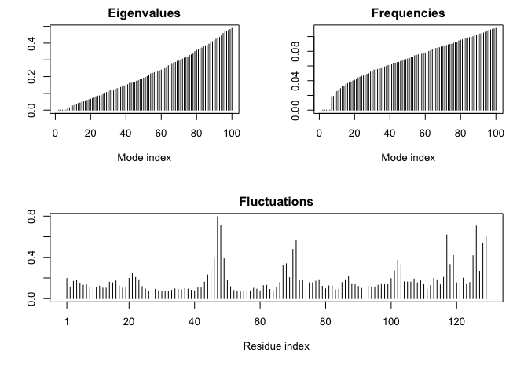

Class 13: Structure Based Drug Discovery
================

Prepare HIV-protease molecule for docking
-----------------------------------------

First get a PDB structure from the online database then clean it up for docking

``` r
library(bio3d)
```

get protein structure from the database

``` r
file.name <- get.pdb("1hsg")
```

    ## Warning in get.pdb("1hsg"): ./1hsg.pdb exists. Skipping download

``` r
file.name
```

    ## [1] "./1hsg.pdb"

Read file into R and clean it up (remove non-protein bits) and save ligand into a separate file

``` r
hiv <- read.pdb(file.name)
hiv
```

    ## 
    ##  Call:  read.pdb(file = file.name)
    ## 
    ##    Total Models#: 1
    ##      Total Atoms#: 1686,  XYZs#: 5058  Chains#: 2  (values: A B)
    ## 
    ##      Protein Atoms#: 1514  (residues/Calpha atoms#: 198)
    ##      Nucleic acid Atoms#: 0  (residues/phosphate atoms#: 0)
    ## 
    ##      Non-protein/nucleic Atoms#: 172  (residues: 128)
    ##      Non-protein/nucleic resid values: [ HOH (127), MK1 (1) ]
    ## 
    ##    Protein sequence:
    ##       PQITLWQRPLVTIKIGGQLKEALLDTGADDTVLEEMSLPGRWKPKMIGGIGGFIKVRQYD
    ##       QILIEICGHKAIGTVLVGPTPVNIIGRNLLTQIGCTLNFPQITLWQRPLVTIKIGGQLKE
    ##       ALLDTGADDTVLEEMSLPGRWKPKMIGGIGGFIKVRQYDQILIEICGHKAIGTVLVGPTP
    ##       VNIIGRNLLTQIGCTLNF
    ## 
    ## + attr: atom, xyz, seqres, helix, sheet,
    ##         calpha, remark, call

Q1: What is the name of the two non protein resid values in this structure? What does resid correspond to and how would you get a listing of all reside values in this structure? -&gt; HOH & MK1

``` r
prot <- trim.pdb(hiv, "protein") #no water
prot
```

    ## 
    ##  Call:  trim.pdb(pdb = hiv, "protein")
    ## 
    ##    Total Models#: 1
    ##      Total Atoms#: 1514,  XYZs#: 4542  Chains#: 2  (values: A B)
    ## 
    ##      Protein Atoms#: 1514  (residues/Calpha atoms#: 198)
    ##      Nucleic acid Atoms#: 0  (residues/phosphate atoms#: 0)
    ## 
    ##      Non-protein/nucleic Atoms#: 0  (residues: 0)
    ##      Non-protein/nucleic resid values: [ none ]
    ## 
    ##    Protein sequence:
    ##       PQITLWQRPLVTIKIGGQLKEALLDTGADDTVLEEMSLPGRWKPKMIGGIGGFIKVRQYD
    ##       QILIEICGHKAIGTVLVGPTPVNIIGRNLLTQIGCTLNFPQITLWQRPLVTIKIGGQLKE
    ##       ALLDTGADDTVLEEMSLPGRWKPKMIGGIGGFIKVRQYDQILIEICGHKAIGTVLVGPTP
    ##       VNIIGRNLLTQIGCTLNF
    ## 
    ## + attr: atom, helix, sheet, seqres, xyz,
    ##         calpha, call

``` r
write.pdb(prot, file = "1hsg_protein.pdb")
```

``` r
lig <- trim.pdb(hiv, "ligand") #ligand is MK1
lig
```

    ## 
    ##  Call:  trim.pdb(pdb = hiv, "ligand")
    ## 
    ##    Total Models#: 1
    ##      Total Atoms#: 45,  XYZs#: 135  Chains#: 1  (values: B)
    ## 
    ##      Protein Atoms#: 0  (residues/Calpha atoms#: 0)
    ##      Nucleic acid Atoms#: 0  (residues/phosphate atoms#: 0)
    ## 
    ##      Non-protein/nucleic Atoms#: 45  (residues: 1)
    ##      Non-protein/nucleic resid values: [ MK1 (1) ]
    ## 
    ## + attr: atom, helix, sheet, seqres, xyz,
    ##         calpha, call

``` r
write.pdb(lig, file = "1hsg_ligand.pdb")
```

Inspecting docking results
--------------------------

``` r
res <- read.pdb("all.pdbqt", multi = TRUE)
write.pdb(res, "results.pdb")
res
```

    ## 
    ##  Call:  read.pdb(file = "all.pdbqt", multi = TRUE)
    ## 
    ##    Total Models#: 14
    ##      Total Atoms#: 50,  XYZs#: 2100  Chains#: 1  (values: B)
    ## 
    ##      Protein Atoms#: 0  (residues/Calpha atoms#: 0)
    ##      Nucleic acid Atoms#: 0  (residues/phosphate atoms#: 0)
    ## 
    ##      Non-protein/nucleic Atoms#: 50  (residues: 1)
    ##      Non-protein/nucleic resid values: [ MK1 (1) ]
    ## 
    ## + attr: atom, xyz, calpha, call

Normal Mode Analysis
--------------------

``` r
pdb <- read.pdb("1HEL")
```

    ##   Note: Accessing on-line PDB file

``` r
m <- nma(pdb)
```

    ##  Building Hessian...     Done in 0.019 seconds.
    ##  Diagonalizing Hessian...    Done in 0.123 seconds.

``` r
plot(m)
```



``` r
mktrj(m, mode = 7, file = "nma_7.pdb")
```

Can now run this on VMD, and play to show predicted flexibility of the molecule!
