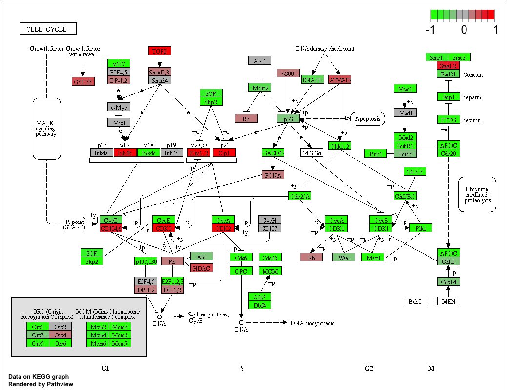

```{r setup, include=FALSE}
knitr::opts_chunk$set(echo = TRUE)
```

## Differential Expression Analysis

My input files for class today
```{r}
metaFile <- "data/GSE37704_metadata.csv"
countFile <- "data/GSE37704_featurecounts.csv"
```

Read the metadata file first

```{r}
#import metadata
colData = read.csv(metaFile, row.names = 1)
head(colData)
```

```{r}
#import countdata
countData = read.csv(countFile, row.names = 1)
head(countData)
```

Q. Complete the code below to remove the troublesome first column from countData
```{r}
# Note we need to remove the odd first $length col
countData <- as.matrix(countData[,-1])
head(countData)
```

How many rows and cols in count data?

```{r}
dim(countData)
```

Check now that my metadata rows and coldata columns MATCH

```{r}
all(rownames(colData) == colnames(countData))    
```

Q. Complete the code below to filter countData to exclude genes (i.e. rows) where we have 0 read count across all samples (i.e. columns).

Tip: What will rowSums() of countData return and how could you use it in this context?

```{r}
# Filter count data where you have 0 read count across all samples.
#head(countData)
#rowSums(countData) != 0
countData = countData[rowSums(countData) != 0, ]
head(countData)
```

New dimesions for genes we ACTUALLY have data for?
```{r}
nrow(countData)
```


#  Example
##  Example
###  Example
####  Example
#####  Example

> this is an example

This is not


## Running DESeq2

```{r deseq_load, message=FALSE}
library(DESeq2)
#don't want this report to appear in knitted document...not related to work
# cannot simply use #, else DESeq2 will not load...use gear icon -> messages = FALSE
```

```{r}
dds = DESeqDataSetFromMatrix(countData = countData,
                             colData = colData,
                             design = ~condition)
dds = DESeq(dds)
```

Get results
```{r}
res = results(dds, contrast=c("condition", "hoxa1_kd", "control_sirna"))
```

```{r}
summary(res)
```

```{r}
head(res)
```

```{r}
plot( res$log2FoldChange, -log(res$padj) )
```

```{r}
mycols <- rep("gray", nrow(res))
mycols[abs(res$log2FoldChange) > 2 ] <- "red"

#use blue cols if FC > 2 and P < 0.01
inds <- (abs(res$log2FoldChange) > 2) & (res$padj < 0.01)
mycols[inds] <- "blue"

plot( res$log2FoldChange, -log(res$padj), col = mycols ) 
```

```{r eval=FALSE}
# above, code will not be executed when doc. knitted

source("http://bioconductor.org/biocLite.R")
biocLite()
biocLite("AnnotationDbi")
biocLite("org.Hs.eg.db")
```

```{r}
library("AnnotationDbi")
library("org.Hs.eg.db")
```

```{r}
columns(org.Hs.eg.db)
```

```{r}
res$symbol = mapIds(org.Hs.eg.db,
                    keys = row.names(res), 
                    keytype = "ENSEMBL",
                    column = "SYMBOL",
                    multiVals = "first")
head(res)

```

```{r}
res$entrez = mapIds(org.Hs.eg.db,
                    keys=row.names(res),
                    keytype="ENSEMBL",
                    column="ENTREZID",
                    multiVals="first")
```

```{r}
res$name =   mapIds(org.Hs.eg.db,
                    keys=row.names(res),
                    keytype="ENSEMBL",
                    column="GENENAME",
                    multiVals="first")
```
```{r}
head(res, 10)
```


Q. Finally for this section let’s reorder these results by adjusted p-value and save them to a CSV file in your current project directory.

```{r}
?write.csv
res = res[order(res$pvalue),]
write.csv(res, file="deseq_results.csv")
```

# Section 2

```{r eval=FALSE}
source("http://bioconductor.org/biocLite.R")
biocLite( c("pathview", "gage", "gageData") )
```

```{r}
library(pathview)
library(gage)
library(gageData)
```

```{r}
data(kegg.sets.hs)
data(sigmet.idx.hs)

# Focus on signaling and metabolic pathways only
kegg.sets.hs = kegg.sets.hs[sigmet.idx.hs]
```

```{r}
# Examine the first 3 pathways
head(kegg.sets.hs, 3)
```

The main gage() function requires a named vector of fold changes, where the names of the values are the Entrez gene IDs.

Note that we used the mapIDs() function above to obtain Entrez gene IDs (stored in res$entrez) and we have the fold change results from DESeq2 analysis (stored in res$log2FoldChange).

```{r}
foldchanges = res$log2FoldChange
names(foldchanges) = res$entrez
head(foldchanges)
```

```{r}
# Get the results
keggres = gage(foldchanges, gsets = kegg.sets.hs)
attributes(keggres)
```

```{r}
# Look at the first few down (less) pathways
head(keggres$less)
```

```{r}
pathview(gene.data = foldchanges, pathway.id = "hsa04110")
```



```{r}
# A different PDF based output of the same data
pathview(gene.data=foldchanges, pathway.id="hsa04110", kegg.native=FALSE)
```


```{r}
## Focus on top 5 upregulated pathways here for demo purposes only
keggrespathways <- rownames(keggres$greater)[1:5]

# Extract the 8 character long IDs part of each string
keggresids = substr(keggrespathways, start = 1, stop = 8)
keggresids
```

```{r}
pathview(gene.data = foldchanges, pathway.id = keggresids, species = "hsa")
```


